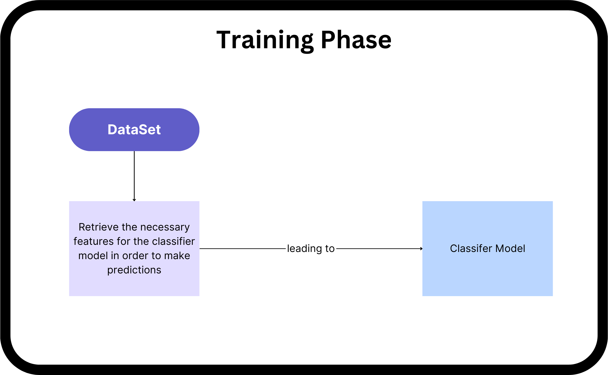

# DataGenie Hackathon 2023

The goal is to create an efficient time series model selection algorithm

## Application demo


## ToDO checkpoints

- [X] Classification Algorithm
    - [X] (Data Generation) Pick/generate the necessary features and label the data required for classification
    - [X] Train Classification Model with (5 output labels) and pickle\store the model.
- [X] Generate predictions  
- [X] REST API
    - [X] setup a template and have a placeholder function 
    - [X] Setup a POST method to use the classification model 
- [X] Simple UI & Deployment
    - [X] setup a template and have a placeholder function 
    - [X] Use the API defined to Display it to the users

## Time series Models used:

- Prophet
- ARIMA
- ETS
- XGBoost

## Approach Notes

The full documentation explaining how the classifier is built can be found in this link. 
This is a condensed version of the PDF

Step 1: Data Generation and Classifier Model Training

- Dataset: Used sample data from the hackathon.

- Approach 1: Divided problem into four formats - hourly, daily, weekly, monthly.
    Built four classifiers for each format.
    Benefits of separate models: Specialization, custom feature engineering, real-world pattern differences.
    Limitations: Cannot predict formats not predefined, increased complexity.

- Combined Approach2:
    Explored combining data from all formats into one dataset.
    Benefits: Broader learning, useful when decision boundaries are not distinct or formats have similarities.
    Combined preprocessed data into a single file.
    Balanced dataset and employed Random Forest with grid search for classification.
    
- Data Generation:
    Utilized four time series models: ARIMA, XGBoost, Prophet, ETS.
    Combined samples, removed duplicates and interpolated missing values.
- Preprocessing:
    Identified best data points for each model using rolling windows and feature extraction.
    Balanced dataset by undersampling and removing uncorrelated features.
- Classifier:
    Used Random Forest with grid search to find best parameters.

Step 2: Backend API and Frontend

- Pickled classifier models.
- Created two FastAPI endpoints:
    ```javascript
    POST /predict?date_from=2021-08-01&date_to=2021-08-03&period=0
    POST /predict_with_format?format=daily&date_from=2021-08-01&date_to=2021-08-03&period=0
    ```
- Frontend:
    Three pages - two for Postman-like interface, one for user-friendly CSV upload.
    Provides charts and predicted values based on forecasting periods.

## PLAN





## Getting Started

Clone the repo in local and follow these steps.

**Backend Setup:**

1. Create a virtual environment:
   ```sh
   cd backend
   python3 -m venv venv
   ```

2. Activate the virtual environment:
   ```sh
   venv\Scripts\activate
   ```

3. Install the requirements and run the application:
   ```sh
   pip3 install -r requirements.txt
   uvicorn main:app --reload --port 8105
   ```

**Frontend Setup:**

1. Create a virtual environment:
   ```sh
   cd frontend
   python3 -m venv venv
   ```

2. Activate the virtual environment:
   ```sh
   venv\Scripts\activate
   ```

3. Install the requirements and run the application:
   ```sh
   pip3 install -r requirements.txt
   streamlit run main.py
   ```
